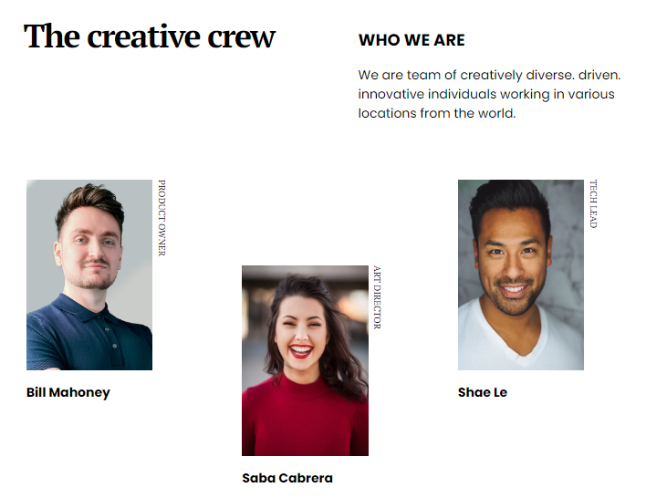

<!-- Please update value in the {}  -->

<h1 align="center">My team page</h1>

   Solution for a challenge from  <a href="http://devchallenges.io" target="_blank">Devchallenges.io</a>.

  <h3>
    <a href="https://franh20.github.io/my-team-page-dev-challenges/">
      Demo
    </a>
     | 
    <a href="https://github.com/FranH20/my-team-page-dev-challenges">
      Solution
    </a>
     | 
    <a href="https://devchallenges.io/challenges/hhmesazsqgKXrTkYkt0U">
      Challenge
    </a>
  </h3>

<!-- TABLE OF CONTENTS -->

## Table of Contents

- [Overview](#overview)
  - [Built With](#built-with)
- [Features](#features)
- [Contact](#contact)
- [Acknowledgements](#acknowledgements)

<!-- OVERVIEW -->

## Overview

- Where can I see your demo?
> Github IO.
- What was your experience?
> Enjoyable.
- What have you learned/improved?
> I learned and improve grid.
- Your wisdom? :)
> Grid is awesome.

### Built With

<!-- This section should list any major frameworks that you built your project using. Here are a few examples.-->

- Html
- Css
- Responsive

## Features

<!-- List the features of your application or follow the template. Don't share the figma file here :) -->

This application/site was created as a submission to a [DevChallenges](https://devchallenges.io/challenges) challenge. The [challenge](https://devchallenges.io/challenges/hhmesazsqgKXrTkYkt0U) was to build an application to complete the given user stories.

## Acknowledgements

<!-- This section should list any articles or add-ons/plugins that helps you to complete the project. This is optional but it will help you in the future. For exmpale -->

- [Grid Layout](https://css-tricks.com/snippets/css/complete-guide-grid/)
- [Flexbox](https://css-tricks.com/snippets/css/a-guide-to-flexbox/)
- [Nth-child](https://developer.mozilla.org/es/docs/Web/CSS/:nth-child)
- [Writing-mode](https://developer.mozilla.org/es/docs/Web/CSS/writing-mode)

## Contact

- Website [franh20.github.io](https://franh20.github.io/)
- GitHub [@FranH20](https://github.com/FranH20)
- Twitter [@franhuichi](https://twitter.com/franhuichi)
